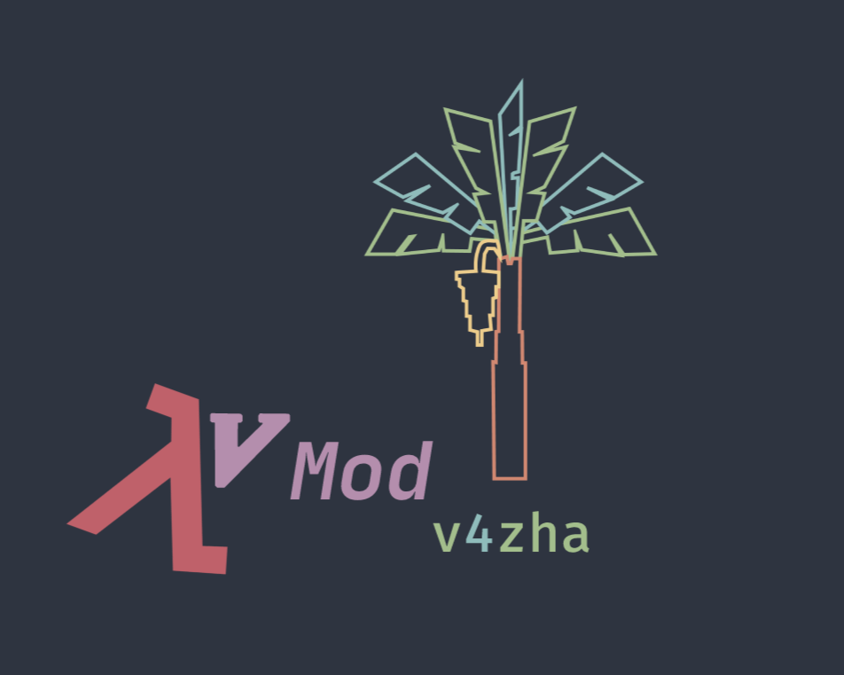

# Vazha Mod Loader

**Vazha Mod Loader** 
is a module bundler to bundle neovim config files written in lua<br>
Vazha Mod Loader provides a fast bundler which looks for modules descibed in the configuration file and bundles all the modules with path namespace in a single lua script.

<br><br>


## Current Features
  
- Provides Configuration file to change config and rebundle.<br>

- Provides custom config path with the optional --cfg flag .
<br>
__Eg:__ 

 ```bash
    vmod_loader --cfg ./v4zha.yml
 ```
- Default config location ~/.vmod/vmod.yml
- required config fields 

```yml
      #Path where Neovim lua modules are located
      #Eg : /home/v4zha/.config/nvim/lua/v4zha
      mod_path: 
          /home/v4zha/.config/nvim/lua/
      #PATH to the New module_bundled lua script 
      res_file: 
          /home/v4zha/.config/nvim/lua/vmod_loader.lua
      #List the modules
      #Eg : 
      modules : 
        -colorsheme
        -keybinds
        -plugin_config
```
<br>

## Installation
- Download from [releases](https://github.com/v4zha/vmod-loader/releases/tag/Latest)<br>

## Build   
- Requires cabal,ghc and necessary build tools.
- Configure cabal build using cabal. configure 
```bash
  cabal build
```
